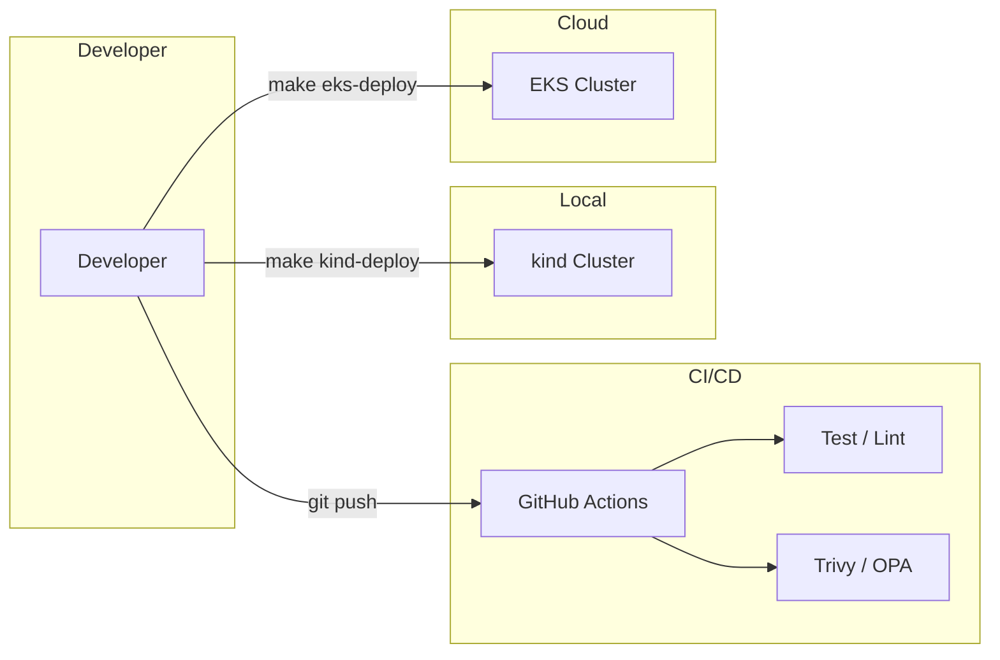
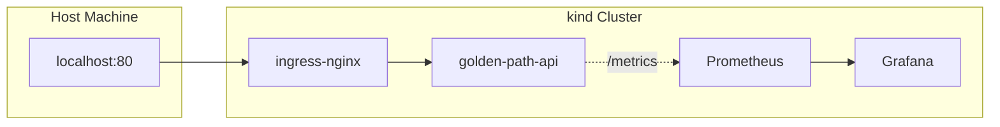
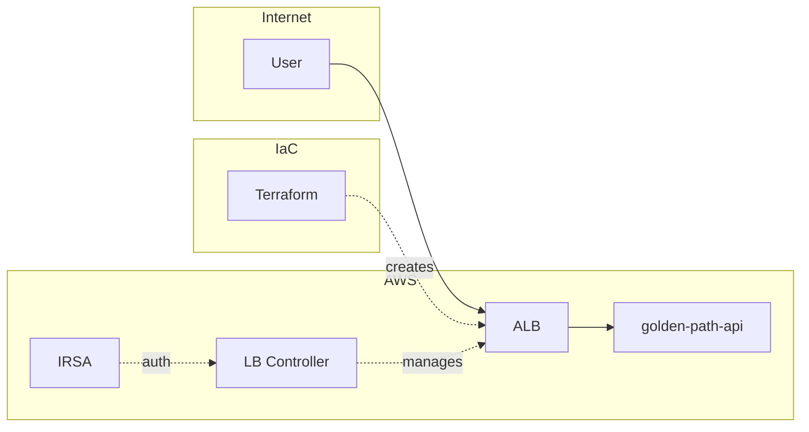

# terraform-eks-golden-path

[](https://github.com/sano-suguru/terraform-eks-golden-path/actions/workflows/ci.yaml)
[](https://github.com/sano-suguru/terraform-eks-golden-path/actions/workflows/terraform.yaml)
[](LICENSE)

EKS + kind の二段構えで、サービス立ち上げ時の「Golden Path（標準化）+ Guardrails（自動チェック）」を形にしたリポジトリです。

## このリポジトリについて

新しいサービスを立ち上げるとき、ログ形式やメトリクス、ヘルスチェック、デプロイ方法をどうするか迷うことが多いと感じていました。チームごとに違う方式になると、後から運用が大変になります。

そこで、以下の3つを意識して作りました：

| 柱 | やったこと |
|---|------------|
| **Golden Path** | ログ・メトリクス・ヘルスチェック・デプロイを最初から決めておく |
| **Guardrails** | CI で lint、テスト、脆弱性スキャンを自動実行 |
| **Reproducibility** | kind（ローカル）でも EKS（AWS）でも同じ Helm チャートで動く |

## 使っている技術

| カテゴリ | 技術 |
|---------|------|
| 言語 | Go 1.24 |
| インフラ | AWS EKS (Terraform) / kind (ローカル) |
| デプロイ | Helm 3.x |
| 監視 | Prometheus + Grafana (kube-prometheus-stack) |
| ログ | 構造化ログ (log/slog) |
| CI/CD | GitHub Actions |
| セキュリティ | Trivy (脆弱性スキャン) + OPA/Conftest (Policy as Code) |
| SBOM | Syft (SPDX JSON) |

## アーキテクチャ

### 全体像

開発者は GitHub にプッシュすると CI が自動実行され、ローカル（kind）とクラウド（EKS）に同じ Helm チャートでデプロイできます。



### kind（ローカル）

AWS アカウント不要で動作確認できる環境。ingress-nginx 経由でアクセスし、Prometheus + Grafana でメトリクスを確認できます。



### EKS（クラウド）

Terraform で VPC/EKS を構築し、AWS Load Balancer Controller が ALB を自動作成。IRSA で最小権限を付与しています。



詳細は [docs/architecture.md](docs/architecture.md) を参照。

## クイックスタート（5分）

### 前提ツール

- [kind](https://kind.sigs.k8s.io/) 0.20+
- [kubectl](https://kubernetes.io/docs/tasks/tools/) 1.28+
- [Helm](https://helm.sh/) 3.x
- [Docker](https://www.docker.com/)

### 手順

```bash
# 1. kind クラスター作成（ingress-nginx 込み）
make kind-up

# 2. 観測性スタック導入（Prometheus + Grafana）
make obs-up

# 3. アプリをデプロイ
make kind-deploy

# 4. 動作確認
curl http://localhost/healthz
# => {"status":"ok"}

# 5. Grafana ダッシュボード確認
make kind-grafana
# => http://localhost:3000 (admin/prom-operator)

# 6. 片付け
make kind-down
```

## API エンドポイント

| Path | 説明 | 外部公開 |
|------|------|---------|
| `/` | Hello レスポンス | ✅ |
| `/healthz` | Liveness probe（依存なし） | ✅ |
| `/readyz` | Readiness probe（初期化完了後 OK） | ✅ |
| `/metrics` | Prometheus メトリクス | ❌（内部のみ） |

## SLO/SLI

| 指標 | 目標 | 計測窓 |
|------|------|--------|
| 成功率 | 99.9% | 5分 |
| p95 レイテンシ | < 200ms | 5分 |

## EKS デプロイ

> ⚠️ **注意**: AWS 料金が発生します。**1日放置で約$5〜10**。検証後は必ず `make eks-destroy` を実行してください。

```bash
# 1. Terraform 初期化
make tf-init

# 2. EKS 構築（約15分）
make eks-apply

# 3. kubeconfig 設定
make eks-kubeconfig

# 4. AWS Load Balancer Controller 導入
make eks-install-lbc

# 5. アプリデプロイ
make eks-deploy

# 6. ALB DNS 確認
make eks-url
# => http://xxxxx.elb.amazonaws.com

# 7. 片付け（必須！）
make eks-destroy
```

## プロジェクト構成

```
├── app/                    # Go HTTP API
│   ├── cmd/api/            # エントリーポイント
│   └── internal/           # ハンドラー、ミドルウェア
├── deploy/
│   ├── helm/               # Helm チャート（kind/EKS 共通）
│   └── kind/               # kind 設定、Prometheus values
├── infra/terraform/        # EKS インフラ
│   ├── envs/dev/           # 環境定義
│   ├── modules/            # vpc, eks, iam モジュール
│   └── policies/           # OPA/Conftest ポリシー
└── docs/                   # ドキュメント
```

## CI/Guardrails

| チェック | 説明 |
|---------|------|
| Go Lint/Test | golangci-lint + go test -race |
| Docker Build | イメージビルド + Trivy スキャン |
| SBOM | Syft で SPDX JSON 生成 |
| Helm Lint | helm lint + helm template |
| Terraform | fmt + validate + OPA ポリシーチェック |

## 詳細ドキュメント

📖 **[技術解説 (IMPLEMENTATION.md)](docs/IMPLEMENTATION.md)**

設計・実装時に考えたことや、具体的なコード例をまとめています：

- **Golden Path の詳細** - ログ・メトリクス・ヘルスチェックの実装
- **Observability** - SLO/SLI 設計、Grafana ダッシュボード、アラート条件
- **Guardrails の実装** - OPA/Rego ポリシー、Trivy、SBOM
- **Terraform モジュール** - VPC、EKS、IRSA の設計
- **Security** - Pod Security Standards、脆弱性スキャン
- **CI/CD パイプライン** - GitHub Actions、OIDC 認証
- **トレードオフと今後の課題** - 現状の設計判断と拡張方針

### その他のドキュメント

- [アーキテクチャ図](docs/architecture.md)
- [設計仕様書](docs/00-spec.md)

### Runbooks

- [高エラー率への対応](docs/runbook-high-error-rate.md)
- [レイテンシ劣化への対応](docs/runbook-latency-regression.md)

## 設計上のトレードオフ

このリポジトリは「ローカルで即座に動作確認できること」を優先しています。
本番環境では要件に応じて以下の拡張が必要です。

### HTTP のみ（HTTPS なし）

独自ドメインを前提としないため、ALB の DNS 名で HTTP アクセスする構成にしています。本番では Route53 + ACM で HTTPS 化します。

### Public Subnet のみ（NAT Gateway なし）

外部 API 連携がなく、コスト最小化を優先しているため Public Subnet のみの構成です。IP 制限のある外部サービス（決済 API 等）と連携する場合は、Private Subnet + NAT Gateway で出口 IP を固定する必要があります。

### ローカル state

追加の AWS 設定なしで `terraform apply` できることを優先しています。チーム開発では S3 + DynamoDB による state 共有が必要です。

## License

MIT
