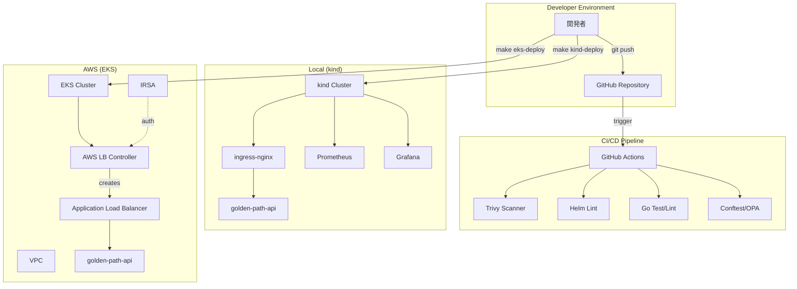
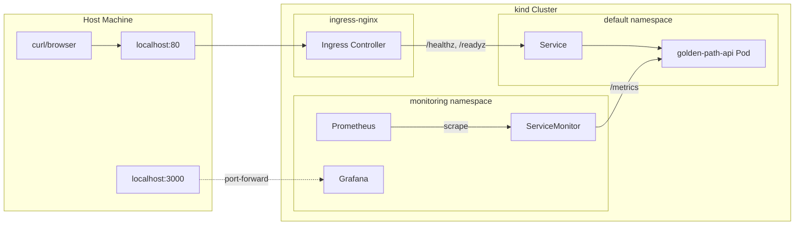
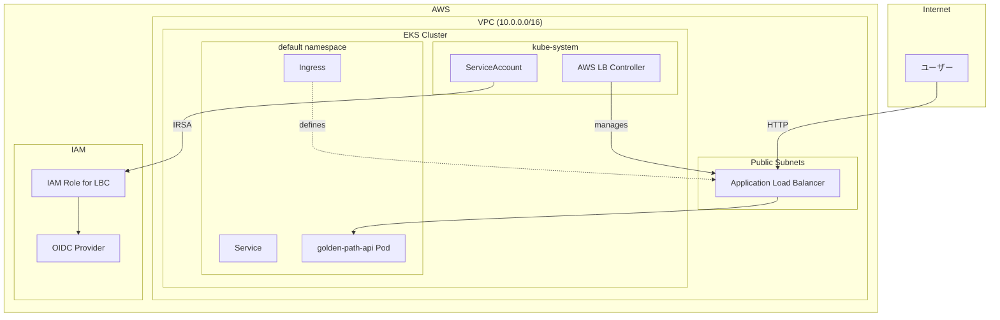
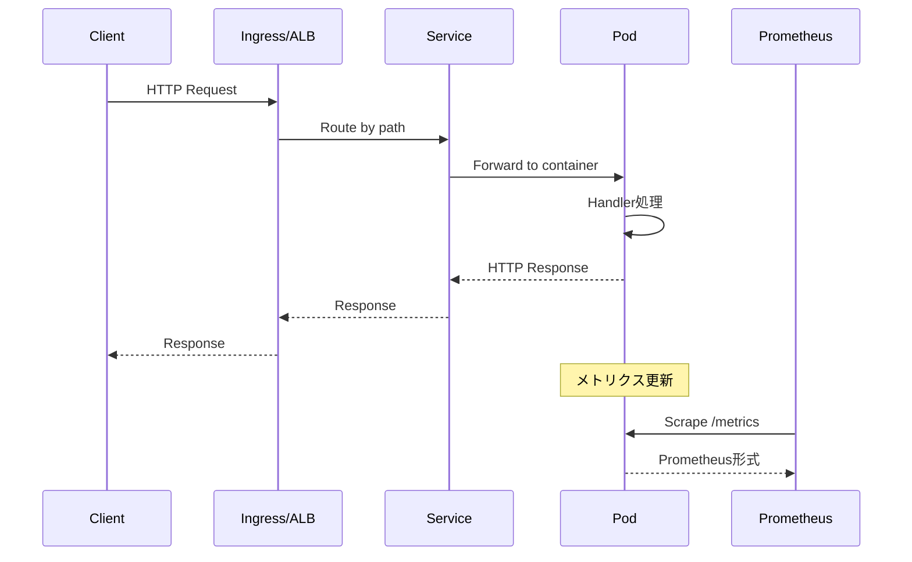
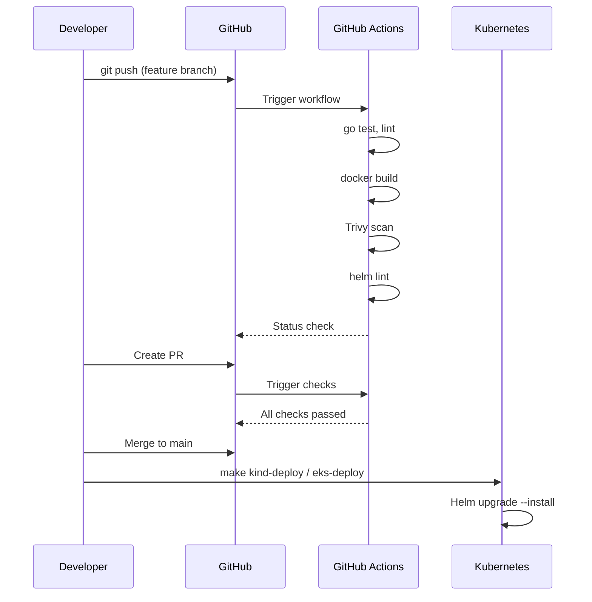
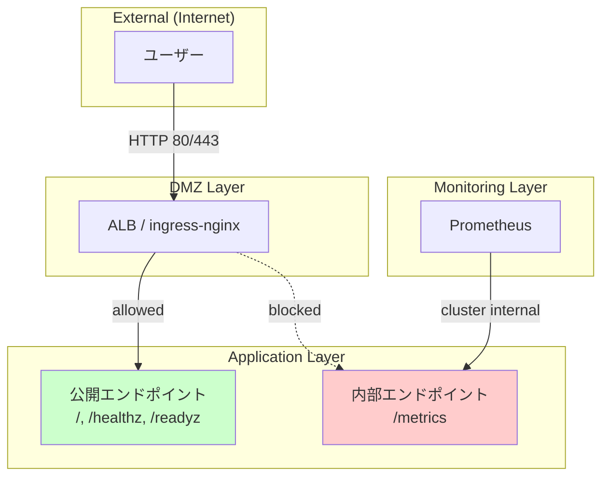

# アーキテクチャ

## システム構成

このリポジトリは「kind（ローカル）」と「EKS（クラウド）」の二段構えで、同じアプリ・同じ Helm チャートで動作します。

### 全体像



### kind（ローカル）構成



### EKS（クラウド）構成



## リポジトリ構造

```
terraform-eks-golden-path/
├── app/                          # Go アプリケーション
│   ├── cmd/api/main.go           # エントリーポイント
│   ├── internal/
│   │   ├── handler/              # HTTP ハンドラー
│   │   └── middleware/           # ミドルウェア
│   └── Dockerfile                # マルチステージビルド
│
├── deploy/
│   ├── helm/golden-path-api/     # Helm チャート
│   │   ├── templates/            # K8s マニフェストテンプレート
│   │   ├── values.yaml           # デフォルト値
│   │   ├── values-kind.yaml      # kind 用オーバーライド
│   │   └── values-eks.yaml       # EKS 用オーバーライド
│   └── kind/                     # kind 関連設定
│       ├── kind-config.yaml      # kind クラスター設定
│       ├── prometheus-values.yaml
│       └── grafana-*.json        # Grafana ダッシュボード
│
├── infra/terraform/
│   ├── envs/dev/                 # 環境定義
│   │   ├── main.tf               # モジュール呼び出し
│   │   ├── variables.tf          # 変数定義
│   │   └── outputs.tf            # 出力定義
│   ├── modules/
│   │   ├── vpc/                  # VPC, サブネット
│   │   ├── eks/                  # EKS クラスター
│   │   └── iam/                  # IRSA
│   └── policies/                 # OPA/Rego ポリシー
│
├── docs/                         # ドキュメント
│   ├── 00-spec.md                # 設計仕様
│   ├── architecture.md           # 本ドキュメント
│   ├── runbook-*.md              # 運用手順書
│
└── .github/workflows/            # CI/CD
    ├── ci.yaml                   # メイン CI
    └── terraform.yaml            # Terraform CI
```

## データフロー

### リクエスト処理



### デプロイフロー



## SLO/SLI アーキテクチャ

```mermaid
flowchart TB
    subgraph "Application"
        APP[golden-path-api]
        METRICS[/metrics endpoint]
    end

    subgraph "Monitoring Stack"
        PROM[Prometheus]
        GRAF[Grafana]
        SM[ServiceMonitor]
    end

    subgraph "SLI Metrics"
        REQ[http_requests_total]
        LAT[http_request_duration_seconds]
    end

    subgraph "SLO Targets"
        SUCCESS[成功率 99.9%]
        P95[p95 < 200ms]
        BUDGET[Error Budget]
    end

    APP --> METRICS
    SM -->|scrape| METRICS
    PROM -->|collect| SM
    PROM --> REQ
    PROM --> LAT

    REQ --> SUCCESS
    LAT --> P95
    SUCCESS --> BUDGET

    GRAF -->|query| PROM
    GRAF -->|visualize| SUCCESS
    GRAF -->|visualize| P95
    GRAF -->|visualize| BUDGET
```

## セキュリティ境界


